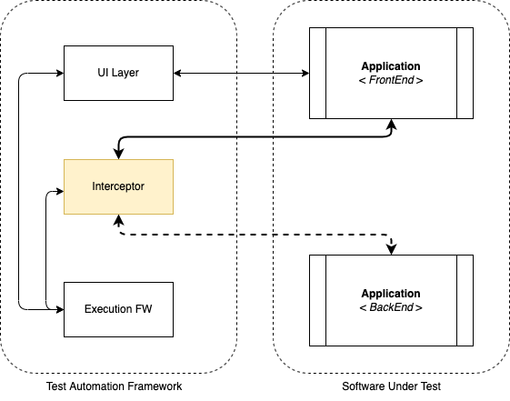

# High-level concept of request interception

Request interception enables you to observe which requests and responses are being exchanged as part of your script's execution.

A network manipulation technique that will enable us to monitor and even modify the traffic.

## Intercept HTTP request

> For more, please read this article about the Technology background: [Intercept HTTP requests](https://developer.mozilla.org/en-US/docs/Mozilla/Add-ons/WebExtensions/Intercept_HTTP_requests)

### Usage strategies

- Inspecting requests and responses
- Intercepting and blocking requests
- Modifying responses for stubbing

#### Examples

This API enables you to add listeners for various stages of making an HTTP request. In the listeners, you can:

- Get access to request headers and bodies and response headers.
- Cancel and redirect requests.
- Modify request and response headers.

Different uses for the module:

- Logging request URLs as they are made.
- Redirecting requests.
- Modifying request headers.

### Testing Strategy

Request interception helps you test the entire lifecycle of HTTP requests within your application. e.g: [Cypress](https://docs.cypress.io/guides/guides/network-requests#Testing-Strategies) provides you access to the objects with information about the request, enabling you to make assertions about its properties. Additionally you can even stub and mock a request's response.

#### Common testing scenarios:

- Asserting on a request's body
- Asserting on a request's url
- Asserting on a request's headers
- Stubbing a response's body
- Stubbing a response's status code
- Stubbing a response's headers
- Delaying a response
- Waiting for a response to happen

The general benefit of request interception in UI testing is that the traditional E2E testing solution can be extended to a lower layer of the application.

This is basically an alternative mocking solution that does not require additional mock server implementations.

The testing solution can be easily enhanced by asserting the activities under the hood.

In an ideal word, the SUT has an architecture that enables targeted tests on the underlying layers but sometimes this is not the case.

#### Test Automation

  

- [Playwright request interception](https://www.youtube.com/watch?v=-pH6Dax-OyY)
- [Intercept HTTP requests](https://developer.mozilla.org/en-US/docs/Mozilla/Add-ons/WebExtensions/Intercept_HTTP_requests)
- [Testing Strategies with Cypress](https://docs.cypress.io/guides/guides/network-requests#Testing-Strategies)
